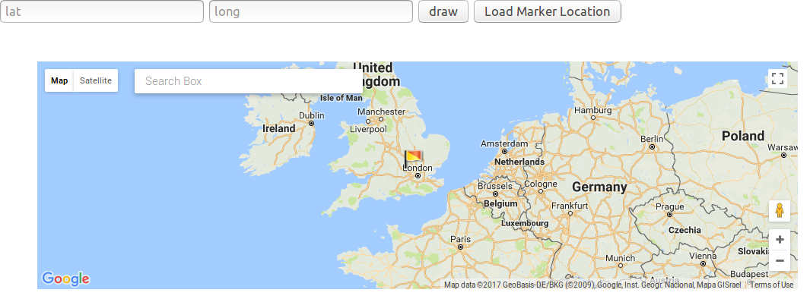

  

# google-map-directive
google map directive by angular 1

You can do:
- search (geocode) then marker location change
- load marker location aftering changing location
- set lat and lon then draw marker on that position
